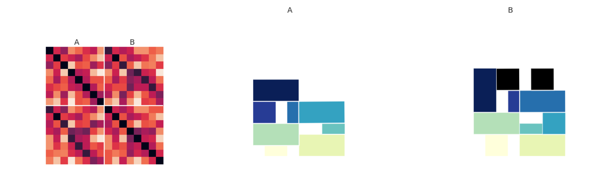
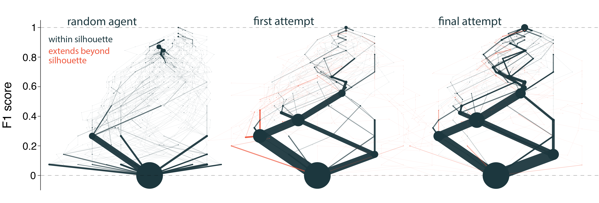

# Learning to build physical structures

  </img>

Project investigating human physical construction behavior.

## Block construction environment
Our block construction environment allows people to build 2D block towers under simulated physics ([Matter.js](https://github.com/liabru/matter-js)). In this version, block snap to valid grid locations just above available horizontal surface.

## Experiment
We ran an experiment to see how people's construction procedures change over repeated attempts.
Over an experimental session, participants saw the silhouettes of 8 block towers (below), either 2 or 4 times.
They attempted to recreate the silhouette using the blocks provided, and were rewarded for accuracy and speed.

  </img> 
  Silhouettes shown to all participants

## Analysis
Our latest analyses can be found in `/analysis/cogsci2020`.

Task performance is analyzed in `block_silhouette_cogsci2020_analysis.ipynb`.

We devide analysis of building procedures between two additional notebooks:

In `block_silhouette_action_sequences.ipynb` we analyze sequences of block-placements, and how these change throughout the experiment.

  </img> 
  Measuring similarity of two sequences of actions taken in first and final build attempts

In `block_silhouette_state_trajectory_analysis.ipynb` we look at the evolving state of the building environment during a reconstruction. We construct graphs containing multiple people's building trajectories, to quantify how similarly people build to each other at the start and end of the experiment.

  </img> 
  Example state trajectory graphs for one structure

Helper functions can be found in `/analysis/utils/`.

## Where to find things

### Analysis
- `/analysis/` contains analysis scripts, broken down by submission. See `/cogsci2020/` for most up-to-date.
- `/analysis/utils/` contains helper functions for e.g. scoring, random agents

### Experiment
- `/experiments/silhouette_2/` contains source code for experiment
- `/experiments/silhouette_2/js/jsPsych/jspsych-block-silhouette-build` is a custom jsPsych plugin created for this experiment. It depends on other files in `js/custom/`, as well as `app.js`
  
### Data
- `/analysis/results/csv/` contains preprocessed and anonymized CSVs for all 105 participants